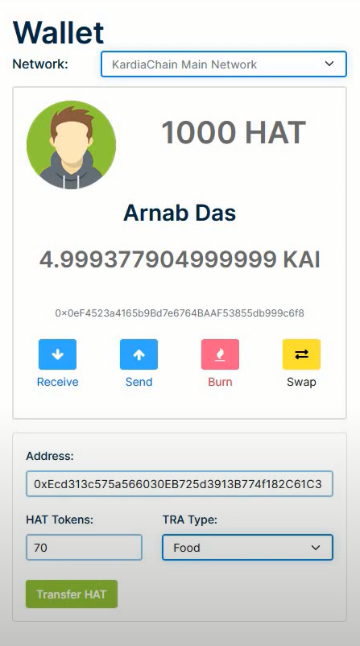
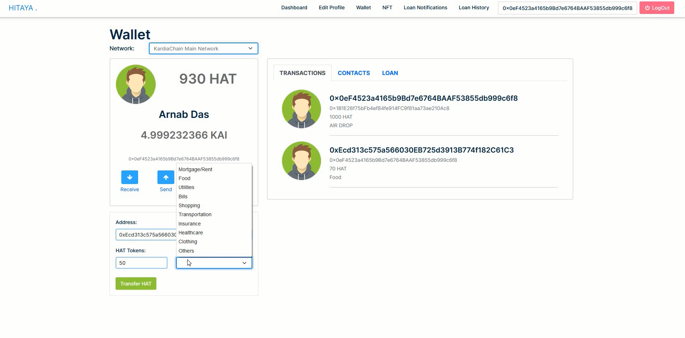

<h1 align="center">HITAYA CIRCLE</h1>

<p><strong>A Financial DApp –</strong> Hitaya is derived from a Sanskrit word that means Welfare.
	
<strong>Hitaya Circle DApp </strong>primary focus is to use Circle Platform API to transfer USDC tokens using <a href="https://developers.circle.com/reference/payments-payments-get">Circe API </a> from one user to another, and give the user a personalized dashboard, to check all this income and expenditure in a given period of time. 

Users can request/give a short loan from a peer/friend using a smart contract and decide upon the interest rate and duration of the loan.

Users can Buy and mint NFT using our platform too.
	



<h3>Key Features</h3>
<ul>
  <li>Transfer USDC</li>
  <li>Personalized Expenditure Dashboard</li>
  <li>Circle API</li>
  <li>USDC Smart Contract</li>
  <li>Verite</li>
</ul>


<br />
<br />


# HITAYA WORKING SAMPLE

For video demostration refer to the YouTube link <a href="https://www.youtube.com/watch?v=L5kDGIO2Htw">here.</a> 


# HITAYA VERITE KYC SCREENSHOTS

Hitaya Circle KYC using Verite Platform.


<h3>How Hitaya Verite KYC will works ?</h3>
<ul>
  <li>A user can upload their identity proof in the form of a image</li>
  <li>The Circle API will verify and give us a JWT tokens, that can be used to verification and KYC</li>
</ul>

<br />
<p align="center">
	
	
</p>
<br />


# HITAYA FINANCE SCREENSHOTS

Hitaya Finance can be used to get soft loans from other peers/colleague/friends belonging to the same organization.


<h3>How Hitaya Finance works ?</h3>
<ul>
  <li>A user can ask for loan (HAT Tokens) from his colleague/friend within an organization at a fixed interest rate.</li>
  <li>The Colleague can accept/reject/negotiate the interest rate and the timeline of the loan repayment.</li>
  <li>If both parties agree a loan is sanctioned from the smart contract.</li>
  <li>And the loan repayment is done by the deducting the amount from monthly salary of the employee after calculating the Monthly payment from the Time, and Interest Rate of loan Repayment.</li>
  <li>All benefit from the agreement as the loan taker can get a lower interest rate on loan, than been charged by the traditional banking System.</li>
  <li>And the loan giver can earn a higher interest on their money, than saving it in the traditional banks systems.</li>
</ul>

<br />
<p align="center">
	
	
	
</p>
<br />

# HITAYA NFT SCREENSHOTS

Hitaya Circle to Mint and Purchase NFT in the Platform (Work in Progress).


<h3>NFTs</h3>
<ul>
  <li>Mint a NFT</li>
  <li>Purchase a NFT from the Hitaya Market Place</li>
</ul>

<br />
<p align="center">
	
	
</p>
<br />

# HITAYA WALLET APPLICATION SCREENSHOTS

<br />
<p align="center">
	
	
	
	
	
	
	
	
	
	
	
	
</p>
<br />


# Hitaya Circle

<h1>Project Requirements</h1>

<h4>Languages</h4>
<ul>
  <li>JavaScript/TypeScript</li>
  <li>Python 3</li>
</ul>

<h4>Frameworks</h4>
<ul>
  <li>Angular 13.2</li>
  <li>BootStrap 5.1.3</li>
  <li>Truffle</li>
  <li>Hardhat</li>
</ul>

<h1>Getting Started</h1>

# Installing Truffle Suite for Local Smart contract deployment :four_leaf_clover:

	Install Ganache and start the local blockchain
```
  $ cd truffle
  $ npm install -g truffle
  $ npm i @openzeppelin/contracts
  $ truffle compile
  $ truffle migrate
  $ truffle migrate — network development
  $ truffle console --network development
```

# Run HardHat

```
$ npm i @openzeppelin/contracts
$ npm install -D @nomiclabs/hardhat-ethers ethers @nomiclabs/hardhat-waffle ethereum-waffle chai
$ npx hardhat run scripts/deploy.js --network rinkeby
```


# Run the Angular App

```
$ git clone https://github.com/IntelegixLabs/Hitaya_Circle
$ cd Hitaya_Circle
$ cd HitayaApp
$ npm install
$ ng serve
```

<h2>That's it!</h2>


